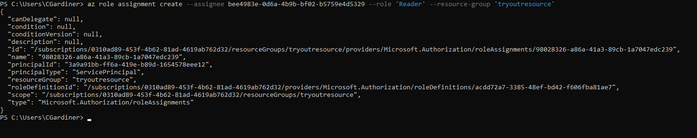

## Get the Service Principal
You can get the service principal's ide by using the app reg's name in the following command:

```PowerShell
az ad app list --display-name '<nameofprincipal>'
```

This will return information about the service principal as JSON.

## How to find information about what app role you want to give the principal

The site AzRolesAdvertizer has information about the roles and what each role can do in Azure. Another way to do this is to use the command:

```PowerShell
az role definition list -n '<nameofrole>'
```

Note: the RBAC role most be capitalised and spaced correctly to work, reader will return empty JSON but Reader will return the definition.

## Add the RBAC

Once you've decided the scope you want to assign the RBAC role of the principal to, you can add the role using the following command:

```PowerShell
az role assignment create --assignee '<nameofprincipal>' --role '<nameofrole>' --resource-group '<nameofresourcegroup(couldberesource)>'
```

## Proof 

Here is proof of the command working in the wild:

