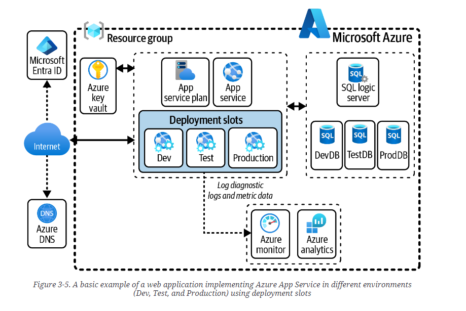

# Azure App Service

Platform as a Service HTTP-based service that enables you to host web applications on the cloud.

Supports .NET, .NET Core, Java, Node.js, PHP, and Python.

Has backup, fault tolerance, geo-redundancy, automatic failover.

Can work with on-prem resources through the Azure Relay Service.

Deployment slots allow for zero-downtime deployments between different versions of the application in production.

Can use containers as well.

Can be connected to Microsoft Entra ID for user authentication.

# Azure Web App for Containers

Azure Web App for Containers enables you to deploy your applications as containers in the cloud with the capability to use custom Docker images with support for autoscaling and deployment.

# Static Web Apps 

Static Web Apps is a single-page application service that allows you to develop full stack SPA web applications that complete CI/CD integration with a code repository like GitHub or Azure DevOps. Can be integrated with things like Blazor Web Assembly, React, Angular, Vue or Svelte.
