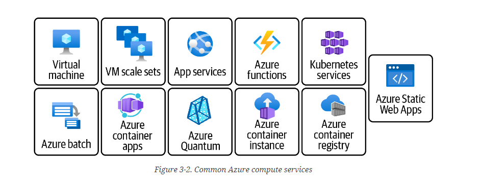

# Azure Compute Services

Compute services are things that are used for running and hosting the workloads for our applications. Such as Azure VMs, Azure VM Scale Sets, Azure App Services, Azure Container Apps, Azure Functions, Azure Kubernetes.

