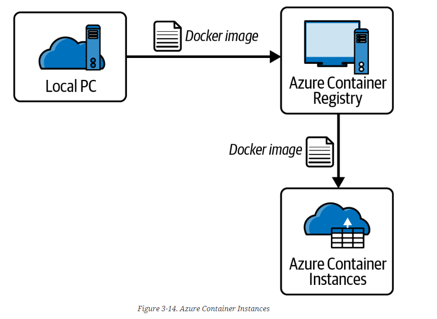

# Container Services

## Azure Containers and Azure Kubernetes Service

Deploy and manage containers that are lightweight.

## Azure Container Registry

Managed service that allows users to store, administer and deploy container images with Azure Kubernetes Service (AKS). Image scanning can scan the containers for specific vulnerabilities.

## Azure Container Instance

## Azure Container Apps

Compute service to allow you to develop and deploy applications and microservices using serverless containers.