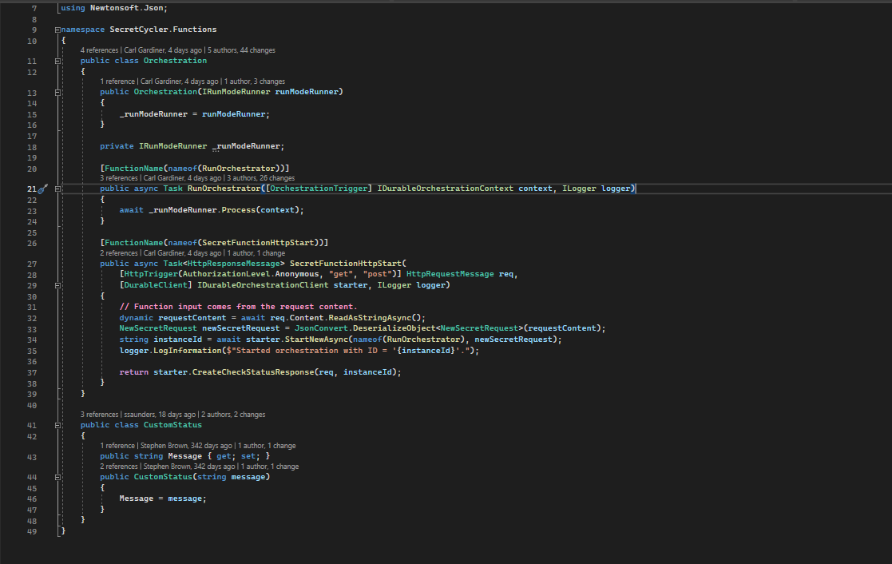

A Function App is a type of resource in Azure that allows you to deploy serverless code which runs only when a specific event (such as a daily cron) triggers it. Functions can be monitored by Azure Application Insights which can be useful for collecting logs and errors. Here is an example of a function app's code, note that traditionally a string is used for the name of the function but you can use nameof instead in order to make it easier to refactor:

