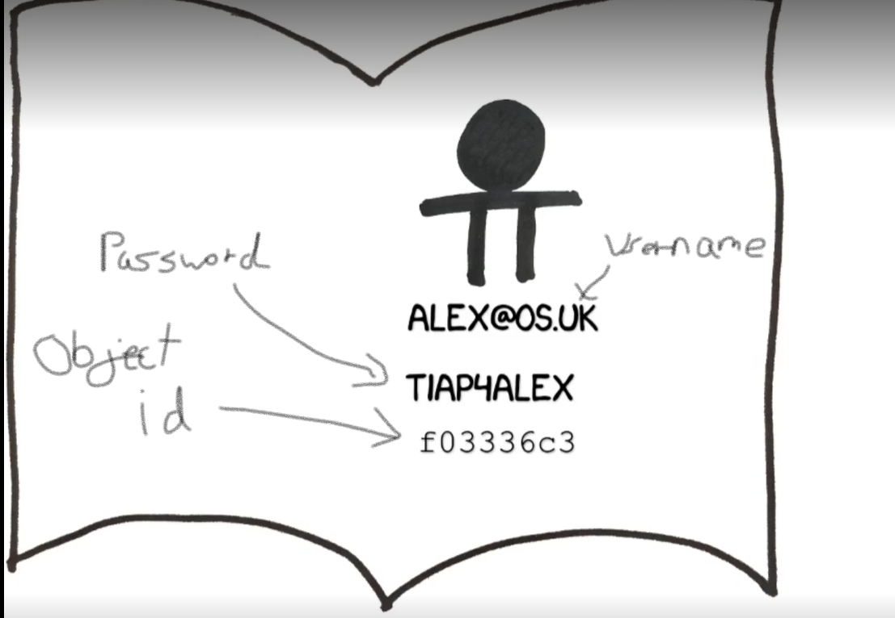
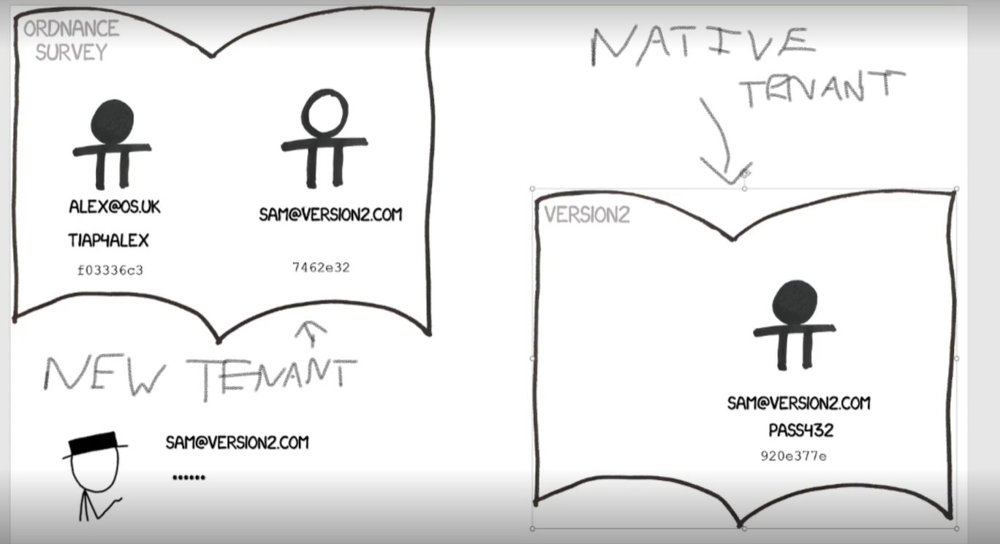

In Azure each organisation can have their own tenant, which is an instance of an Azure Active Directory (AAD).

## Member Users

Member Users are User Principals existing in Azure Active Directory that can be thought of as users which are native to that organisation. In AAD they will have a username, password and an object ID (which is a globally unique id for that directory).

## Guest Users

Guest Users are User Principals which are native to a separate organisation but have been invited to another organisation's tenant. A reference to that user is given to the other organisation's tenant, but the password is kept on the native AAD, whilst a new object ID is given on the new tenant. This is to prevent passwords becoming unmanagable. 

When a user types in their password, as the native tenant is the one that owns it, the guest user's password will be checked on their native tenant and that tenant will pass a token back to the new tenant to confirm the guest user is who they say they are.

## Difference between members and guests

The main difference between members and guests is where the password for their user principal is stored. If they are members of a tenant that tenant will store their password, if they are guests another tenant will have their password.