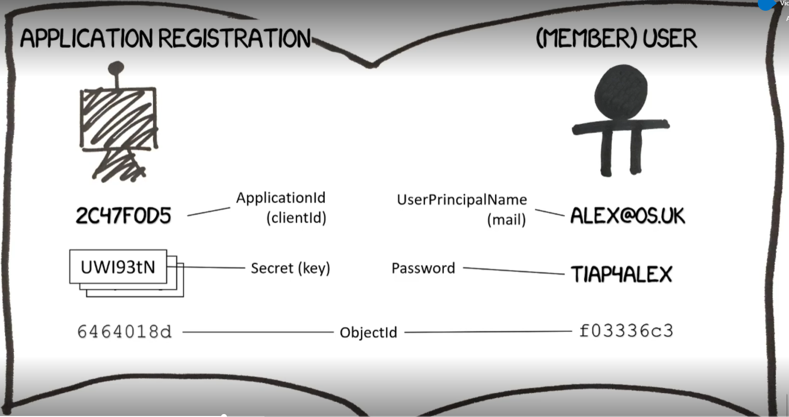
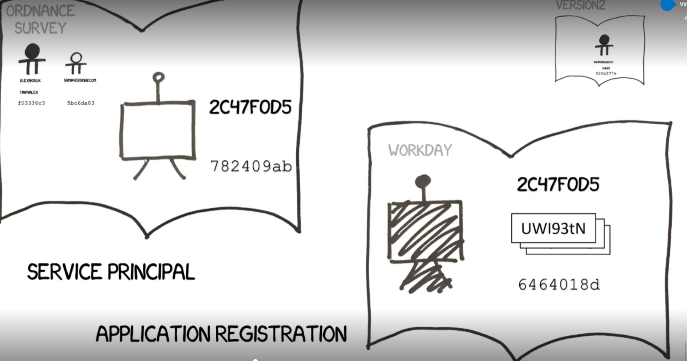
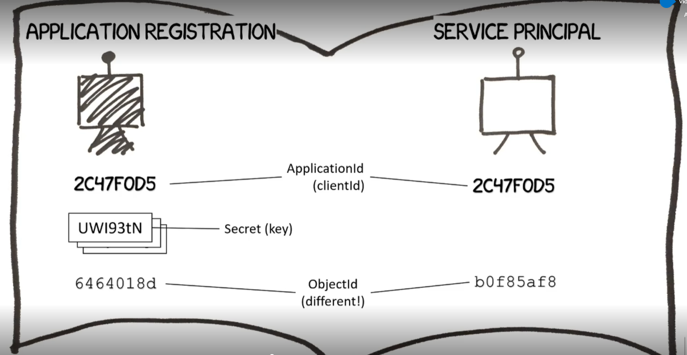

## Application Registration

An Application Registration in Azure Active Directory is similar to how a Member User Principal identifies a user but is instead used for an application that you want to be registered on your tenant.

Instead of a UserPrincipalName, an Application Registration has an ApplicationId (also known as a clientId) and instead of a Password a Secret (also known as a key and there may be multiple). An Application Registration still has an Object Id globally unique to that tenant, however.

## Service Principals in multiple AADs

In the same way that a Guest User Principal is a reference to a Member User Principal in another tenant, a Service Principal is a reference to an Application Registration in another organisation's tenant. This has the same ApplicationId, a different Object Id and don't take any of their secrets over.

## Service Principal in single AAD

If an application has its Application Registration in the current directory, you also need a Service Principal so that you can actually use the application (for example, in OS you would have an Application Registration and then a Service Principal as well in the same tenant.) To tell the difference between the two, the Application Registration will have secrets. Application Ids will be the same.

## Other names for Service Principals

Service Principals can also be called Enterprise Applications, can also be called a Managed Application In Local Directory, or Managed Identity for Azure Resources (this one is weird in that you won't see the ApplicationId for these ones).