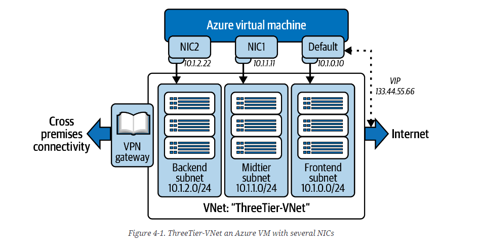

# Networking

## Azure Networking Services for Connectivity

### Azure Virtual Network

Azure resources need to communicate securely with each other over private network, over the internet, and also to on-prem infrastructure. VNETs make this possible.

Internet Communication - VNETs are capable of communicating outbound to the internet.
Communication and connection to Azure resources - Resources can be deployed in the same virtual network.

### Azure VNET Peering

Allows the connection of several virtual networks in Azure. VNET peering can be configured by ARM template.

There are two types of IP address used in Azure, public and private IPs. Private IPs are used for connectivity in the same resource group and public is used for the internet.

### Azure VPN Gateway

Used to send encrypted traffic between an Azure Virtual Network and an on-premises location over the public internet. Also can be used to send information over the Microsoft network.

### Azure Load Balancer 

Helps to distribute workload across several compute resources. Helps optimise resources. 

### Azure Application Gateway 

Azure Application Gateway is a load balancer for web traffic. It enables you to manage and control the traffic to your web applications.