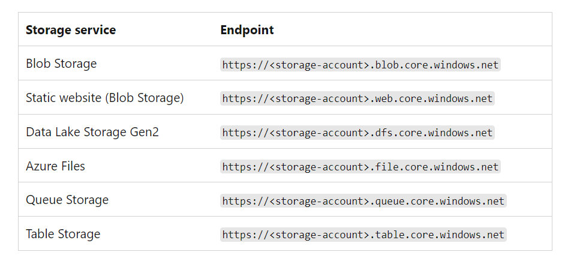

Storage Accounts are resources inside Azure subscriptions which can contain stored data objects. Azure storage can contain blobs, file shares, queues, tables and disks. 

## Naming conventions

Storage account names must be unique and they can only contain numbers and lower case letters.

## Type of storage account data objects

Blobs - Scalable object store for text and binary data
Files - Fileshares for cloud or on-premise deployments
Queues - messaging store for consistent messaging between application components.
Tables - NoSQL store for structured data.
Disks - Storage for virtual machines.

## Endpoints

Here is a list of endpoint names in the Microsoft docs that show what endpoint will be created with each type of data object you create:

