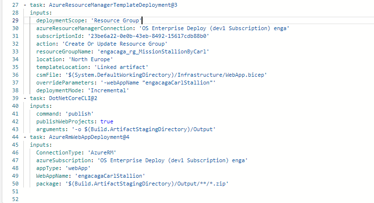
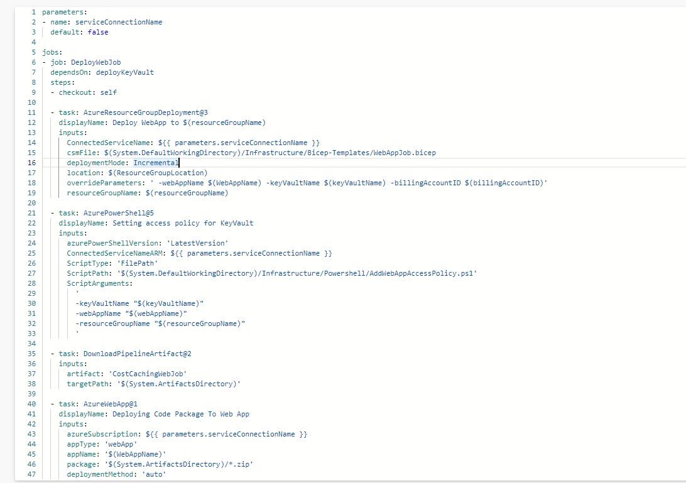

## Real World Example of deploying a WebApp

The first example shows the deployment of a WebApp to a resource group, and then publishing the code in the pipeline and using the artifact to deploy the code to the WebAPI code to the WebApp in the final step.

The second example shows the deployment of a WebApp where the WebJob code is downloaded from an artifacts directory created elsewhere in the pipeline and then pushed into the WebApp infrastructure.