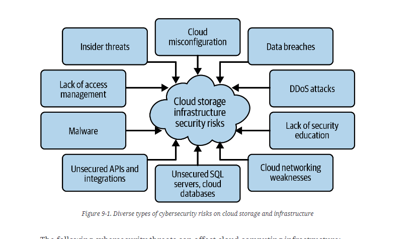

# Azure Security Vulnerabilities

# Different Types of Security Vulnerabilities

## Data breaches

Caused by weak passwords, lack of risk awareness, misconfigured permissions.

## Distributed Denial of Service (DDoS)

Extreme network traffic, usually using a botnet.

## Malware

Infected files are uploaded

## Insider Threats

Intentional or unintentional misuse by employees of the company.

## Misconfiguration of Cloud Resources

Wrong network configs, lack of protection or patched software, etc

## API Vulnerabilities

APIs used and integrated with applications and workloads in the cloud can be vulnerable to networking or endpoint attacks if they are not adequately secured.

## SQL injection attaacks

Insert malicious SQL code into the application's database

## Man-in-the-middle attacks

Man in the Middle attacks involve intercepting transmissions between two parties to steal sensitive data.

## Zero-day exploit

These threats take advantage of vulnerabilities that still need to be discovered or have not been patched by the vendor.

# Zero-Trust

Cloud-based services assumes a breach and verifies each request as if it came from an uncontrolled network.

Goes through Microsoft Entra ID and MFA being enforced.