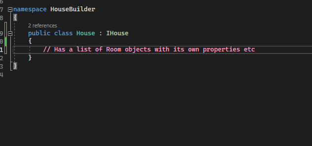

## Definition
The Builder Pattern is a design pattern originally defined by the Gang of Four in the book Design Patterns. It describes a design pattern that should be used when you want to 'separate the construction of an object from its representation so that the same construction process can create different representations.' The builder pattern consists of five separate 'elements' of code. These five elements are:


##  The Builder

The builder is an abstract interface (in C# would be represented by an interface such as IBuilder) that is used to build a Product. The ConcreteBuilder will implement from this element.


##  The ConcreteBuilder

The ConcreteBuilder is an implementation of the Builder. This is what actually constructs and assembles the Product. It keeps track of the Product as a member variable.


##  Director

The Director constructs an object using the Builder interface.


## Product

Represents the complex object under construction. Defines the process by which it is assembled.



## The Client

The Client creates the Director with the correct type of desired Builder object.


## Program code


## Steps in the Builder Process
1) The Client will have a Director class as a member variable which will itself take in a member variable of a type that implements from the Builder interface.
2) The Director notifies the ConcreteBuilder implementation whenever a part needs to be added to the Product.
3) The ConcreteBuilder handles the construction of the desired part.
4) The Client will eventually receive the product from the Builder.

## Reasons for using the Builder Pattern
1) Because the ConcreteBuilder implements from the Builder interface, changing the internals of the ConcreteBuilder's method can change the Product produced significantly without affecting the rest of the code, allowing for different types of ConcreteBuilders to be easily swapped out, meaning modularity is good. Because the Director controls calls to the ConcreteBuilder, the creation of the Product is encapsulated by the ConcreteBuilder's methods. Ultimately, this means you can use different ConcreteBuilders to build different Products.

2) The Director can control how the ConcreteBuilder handles the construction, allowing for different variations on each Product class to be created and returned based on differently inputted information, for example, one call from the Director to the ConcreteBuilder could build a House object with 5 doors, whereas another might have three. This allows for situations where the Product could have a large number of variations and creating a different implementation for each variation would require too much work and would be unreasonable.

3) It cleans up your code. Because the Builder Pattern builds up an  object over time instead of newing up one with all the arguments, an object that requires lots of arguments becomes easier to read when constructed this way, for example:

4) Code reusability. You could use the same builder pattern across multiple areas of code to return a different instantiation of a Product with different parameters depending on where it is called and what methods are chained.

```C#
IHouse house = new House(bathroom, kitchen, toilet, barbecue, swimmingPool, 1, false, 2.4, laundryRoom, "12 Sparrow Lane", "HG34 786", false, true);
```
is horrid and includes many unclear arguments and is difficult to keep track of, whereas :
```C#
builder.AddBathroom(bathroom);
builder.AddKitchen(kitchen);
//etc