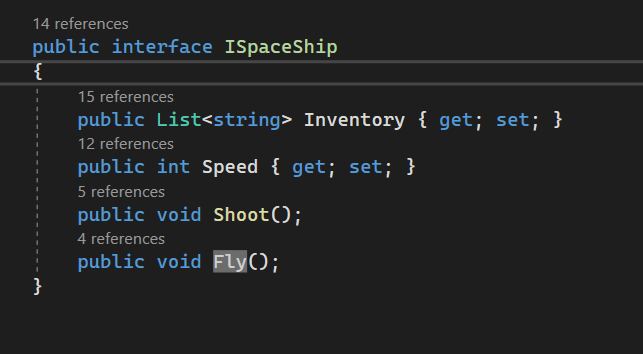
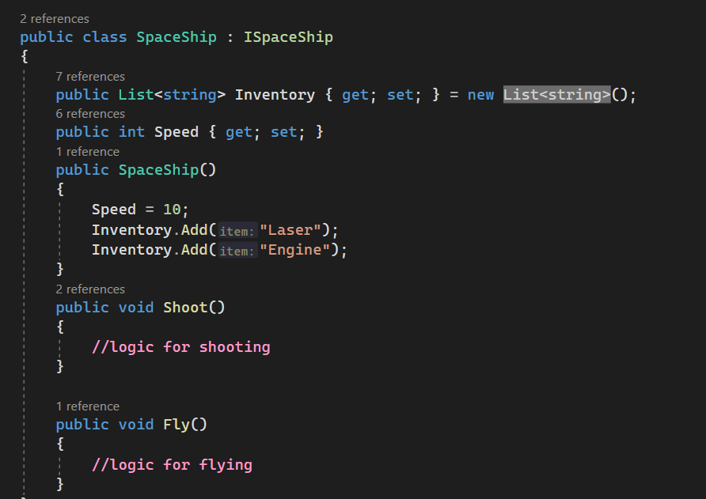
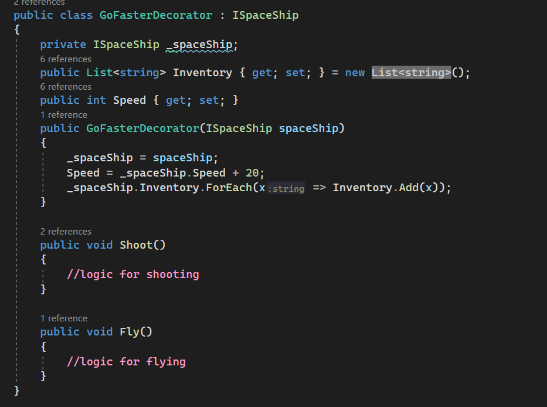
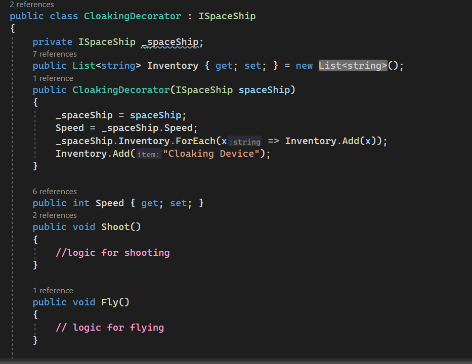
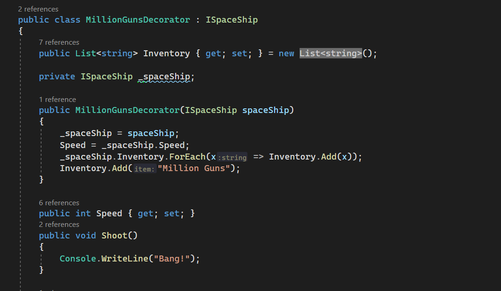
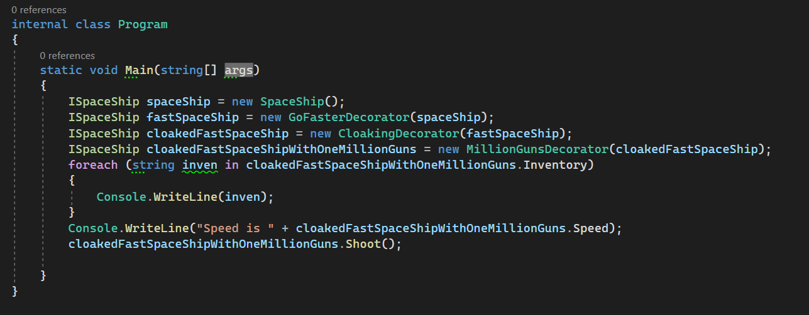
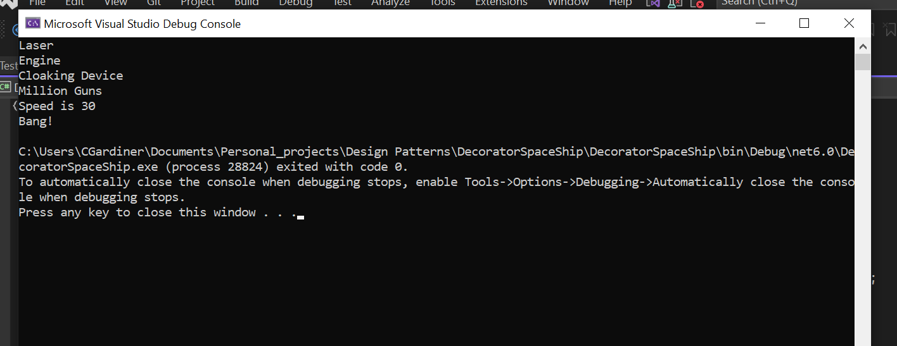

## What is a Decorator?

A decorator is a class that acts as a wrapper and can add extensibility to a class of the same type by 'wrapping' it up. A way of thinking about it is that if Russian Dolls implement from an interface IRussianDoll, and a SmallRedRussianDoll is the most simple implementation of that interface, then any RussianDoll classes that would add features, would be classed as decorators.

## Example

Say you wanted to make a scifi game where the player had a spaceship. Say you wanted to make sure that the player was able to customise the spaceship to a high degree and decided you were going to use objects to represent the in game ships. You could define an implementation or a subclass from an abstract class/interface for every different type of ship that the player could have. However this would lead to an incredibly large amount of subclasses; you would have to define a `SpaceShipWithLasers`, `SpaceShipWithLasersAndCloaking`, `SpaceShipWithRailGunAndCloaking`, `SpaceShipWithLasersAndRailGunAndCloakingAndSensors` etc. This would obviously be an unwieldy solution that would require you to write a lot of code and this would be incredibly hard to refactor if anything went wrong. A better way of handling this situation would be to define decorators for each extension that you could give the SpaceShip class.

## How it works
You can have an ISpaceShip interface with a List of strings called Inventory and a Speed with two methods, fly and shoot.

From that you can create a concrete class called SpaceShip which starts with a Laser and an Engine in its Inventory and a Speed of 10.

You can then pass a reference of that SpaceShip to a GoFasterDecorator class's constructor to populate a _spaceShip field. As the GoFasterDecorator is also implemented from the base ISpaceShip, in the calling code it can be used like the SpaceShip object. However the GoFasterDecorator adds 20 to the speed of the space ship in game.

You can then pass the reference to the GoFasterDecorator object to the CloakingDecorator, which retains the Speed but adds a Cloaking Device to the ship's Inventory.

You can then pass the reference to the MillionGunsDecorator. This adds one million guns to the ship's Inventory but also changes the Shoot method through polymorphism, meaning that this changes how the player's space ship shoots in game.

When the following code is run, the player's ship has been built up using decorators to have a different result in the end.

## Conclusion
From here you could add lots more decorators and would not be hampered by the many different combinations of results you could get in the end. This means that the Decorator pattern is easily extensible and is good for creating configurable objects in code without having infinite variations of subclasses. In a game like the one described above, you could also use Decorators to take away features if there was for example a limit to the amount of functionality your ship could have.

