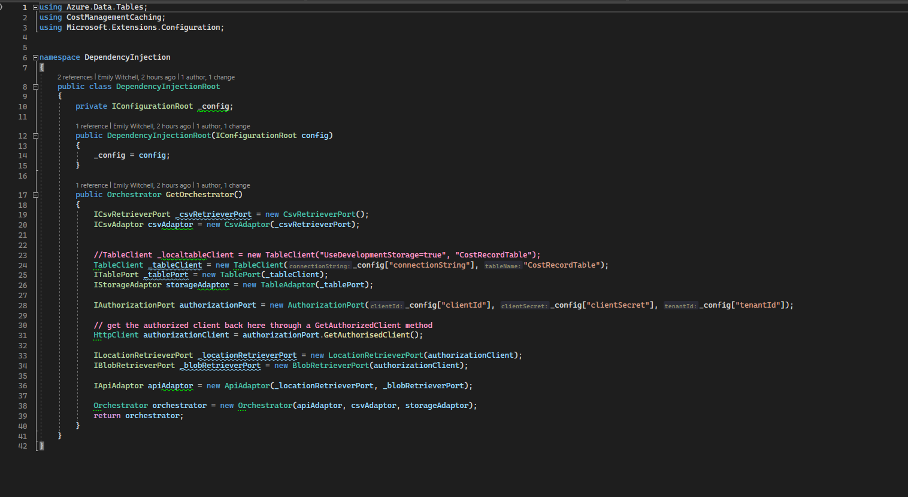

Here is an example of Pure Dependency Injection. Here the objects necessary to start up an orchestrator for a main function (in a console app or otherwise) are being created and dependency injected into each other, eventually returning an Orchestrator which contains all the objects. 

The use of Pure DI is good because it allows you to swap out classes that are derived from the same interface and also allows you to mock objects easily in testing code. The easy swapping out of objects allows good separation of concerns, decouples code and means that a break in your code due to outside events is easily replacable if the Liskov Substitution Principle is followed because creation of a new class with similar but slightly different functionality is very easy.