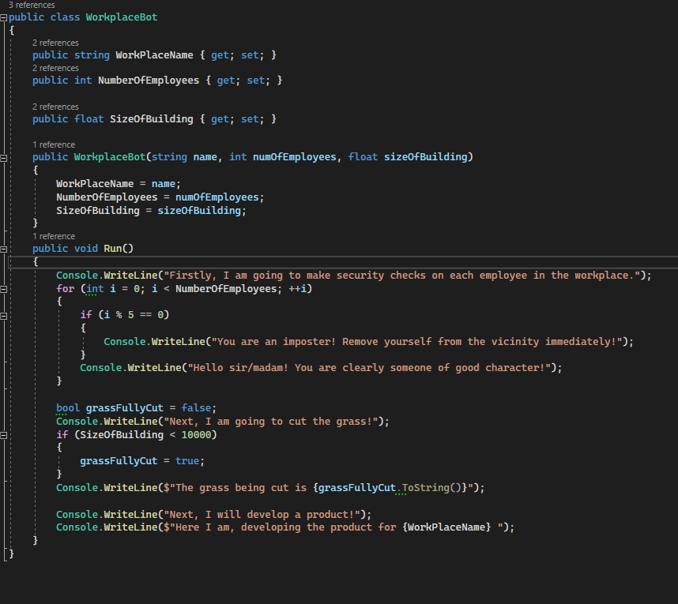
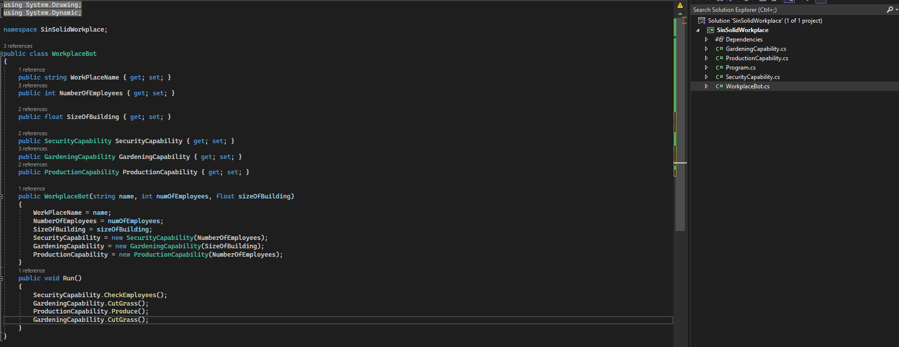

The SOLID principles are five principles of Object-Oriented class design.

## The S in SOLID

The S in SOLID stands for Single Responsiblity Principle

The single-responsibility principle states a class should only have only one responsibility and therefore only one reason to change.

Practically, this prevents classes from getting to large, and allows you to split up your code so that using techniques like mocking and dependency injection in testing should be very easy.

As a theoretical example, if you have a WorkplaceBot class, you could have it have a bunch of methods that call on certain things to deal with the specifics of running a workplace. For example, you could have methods for cleaning, developing products, managing employees, securing the perimeter etc

As an example, here is a piece of code that would fundamentally violate the single responsibility principle:

Here the WorkPlaceBot class is handling many different things at once. It is making security checks, which includes a lot of logic, it has some logic for whether or not the grass is going to be cut, and also what it will do for developing products. There are multiple reasons that this class could change now. If the method of security checks was found to be faulty (and it most certainly is) then changing it could break the code and this class would be responsible. Elsewhere, the ability of the WorkplaceBot to garden could improve, meaning that change could also break the code. Doing this would mean that you would now have two potential breaks in the system, and you would need to find out which one had broken the system in your tests which would be harder to debug as you wouldn't have unit tests which could pinpoint the exact class responsible. Also a change to the grass cutting logic would mean rewriting the strings in two places, wasting developer time.

Here is an example of a more clean, but not necessarily amazing way of using the single responsiblity principle.

In this each capability of the WorkPlaceBot has been moved into its own class, for example it now has a SecurityCapability that only deals with security, a GardeningCapability that deals with gardening etc. This allows us to have the WorkPlaceBot's Run function act as a clean orchestrator of the code and also allows us to change any of the classes and still have the code work (and if the code breaks then we know where the problem is). It also allows us to start using interfaces and we could potentially change out different capabilities for others that implement from a single interface, allowing us to mock in tests and change up the capabilities of the WorkPlaceBot if need be.