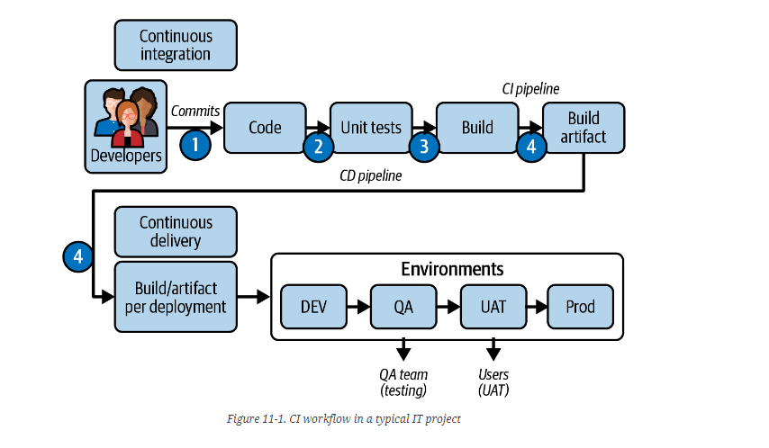

# DevOps Terms

## CI

Continuous Integration means frequently integrating the code changes done by developers working in parallel and committing them into a shared code repository.

In a CI pipeline, the CI system automatically builds, tests and deploys the code to a testing environment.

## CD

Continuous Deployment means automatically deploying every change developers make to a production environment, and follows the Continuous Integration steps.

## CM

Continuous Monitoring refers to monitoring the application after it has been deployed.

