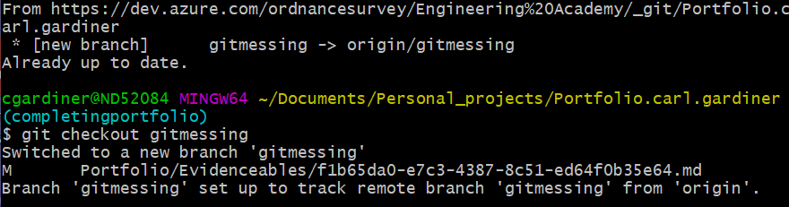

A branch can be remote rather than local. This can easily happen when multiple developers are working and pushing to the same remote repository (a fairly standard practice). Here is how this can happen:

1) Both you and another developer clone down the same remote repo.
2) The other developer makes a branch on his local repo. He then uses the command 'git push --set-upstream origin branchA', which pushes his branch up to the remote repo and sets his local repo to track that branch.
3) As you have not had any contact with the remote repo since that developer pushed up, the branch will not exist on your local repository.

In order to rectify this, you can use git fetch or git pull in order to make the objects and metadata of the remote branch appear in your local repo's .git folder, and checking out to the previosult remote branch will set it up to track the remote branch of the origin.

