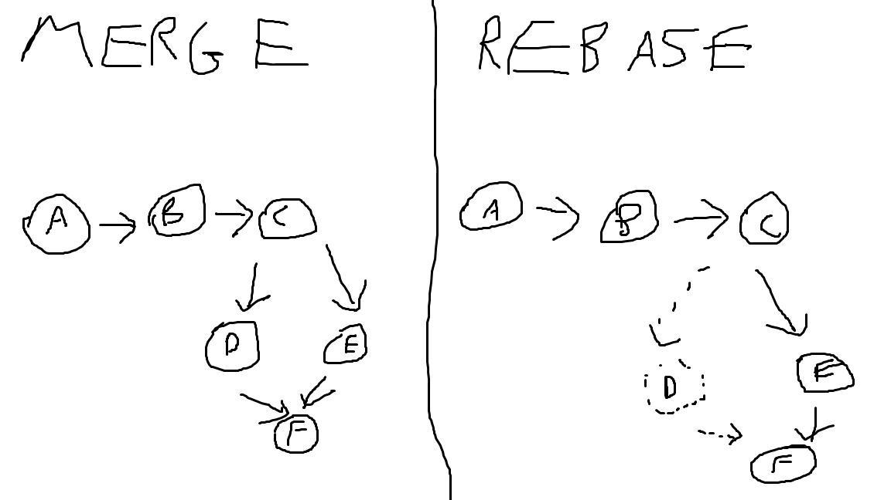

In git, merging unifies two or more commit histories of branches. Rebase does the same sort of thing except not in the same way but gets the same results in terms of what the working tree will look like afterwards.

## Git merge
Git merge combines two branches histories and creates a new commit. In this a final commit is made after that inherits from both 'parent' branches. This is usually fine (especially in 'fast-forward' merges in trunk-based development where only one branch is ahead of the other and it is just bringing the main up to that feature branch's history), however if many branches are merging into each other over time the history can get messy. That is where git rebase comes in.

## Git rebase
Git rebase 'rewrites' the history when two branches are combined. It is done in the opposite 'direction' as merge, where you need to be on the branch that you want to rebase onto anoother branch when making the command (eg 'git checkout feature' then 'git rebase main' if you want to rebase the feature branch on top of main). Rebase makes it look as though there is only one long line of commit history, by placing rewriting one branches commits 'onto' the branch on which it is rebasing onto, making it look like there was only one branch in the commit history. In the picture below, you can see how the commit E is handled differently in both merge and rebase, with E ending up essentially not existing in the commit history, as a new commit was written for it in the main branch.

## Problems
In both git merge and git rebase, you can run into conflicts with files conflicting that need to be resolved.
