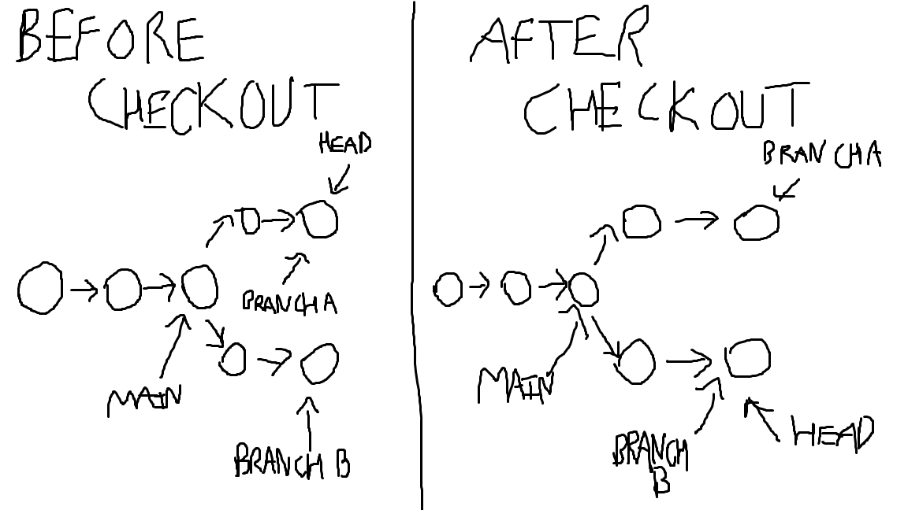

## Diagram of Git checkout

## Explanation of diagram

In the diagram, there are two branches that diverge from main, branchA and branchB. The HEAD pointer always refers to the most recent commit on the current branch, so at first the current branch is branchA. After the command 'git checkout branchB' is made the HEAD pointer switches to the most recent commit on branchB. 
