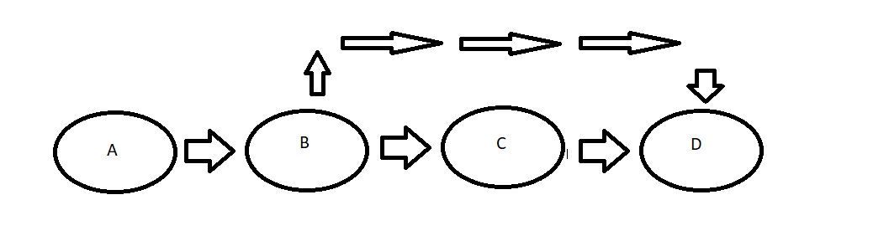

In the above diagram, let's say that the HEAD starts at point C, and D has not been created yet. Using:

```git
git revert HEAD
```

A new commit is created (commit D) with the changes between commit B and commit C being undone.