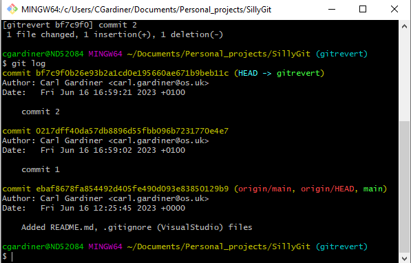
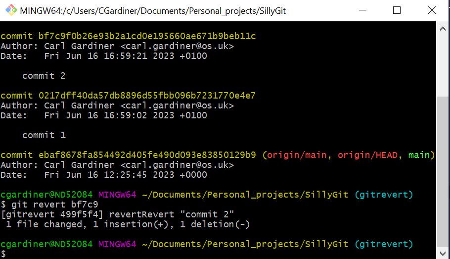
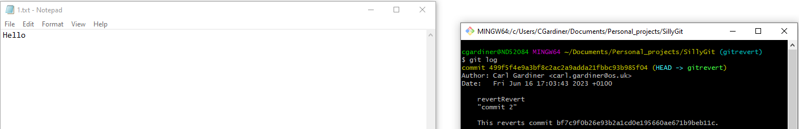

Git revert is a command that 'undoes' changes. However it doesn't go back in time as much as just reverses the commit that you specify as an argument and creates a new commit in the history that still moves the history forward. It can be considered a more safe way of undoing changes that git reset, which with the --hard argument can cause all sorts of trouble with lost work.

## Starting off


Here three text files have been created. These text files are what I will modify to show how things change.

## Making a series of commits

I then will change files and make a series of commits, in the logs it looks like this:



At this point, 1.txt has 'Hello World' in it, and on the previous commit it had only 'Hello'.

## Performing the revert

Using the command 

```git
git revert ebaf8
```
This happens:



which removes the text of 1.txt, which had 'Hello World' in it.

## Checking 1.txt again



Here you can see that 1.txt now only says Hello. Bare in mind that if I had used git revert on the initial commit, nothing would have happened to this text file, as git revert only reverse THAT particularly commit's changes, and the intial one didn't change 1.txt, therefore wouldn't have changed the text file.

Git revert with an argument of HEAD will simply move the commit back one, and is probably the more useful command in this situation.
