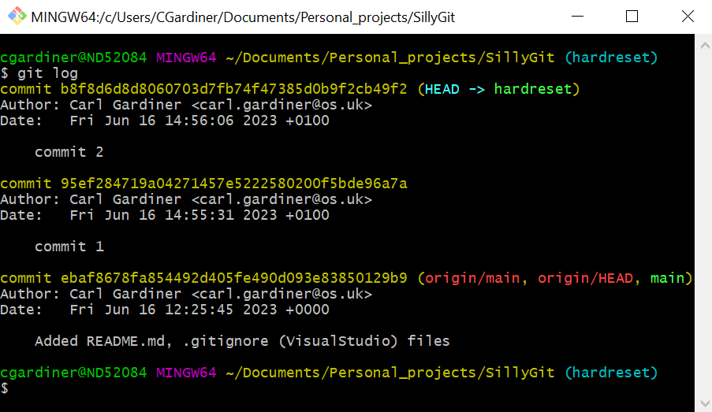

Git reset is a command for undoing changes that have occurred. It has three different arguments:

--soft
--mixed
--hard

Calling git reset on its own has the same affect as calling git reset --mixed HEAD.

I will talk about the command 'git reset --hard'.

A hard reset is the most common way of resetting the commit history in git. A hard reset works like the standard reset except that it also resets the staging index and the working directory to match the specified commit. Any work that was only hanging out on the working tree or staging directory can therefore be lost using this method. Due to git's garbage collector removing unreferenced commits after a few weeks by default work can be lost this way. In order to go back to a commit after resetting hard, you can use 
```git
git reflog
```
 and 
```git
 git reset --hard <shaofcommityouwant>
```

in order to get back work, but again this must be done within the month.

## Starting off


Here three text files have been created. These text files are what I will modify to show how things change.

## Making a series of commits

I then will change files and make a series of commits, in the logs it looks like this:



## Change the text files

I will then change two text files, adding one and not adding the other, and performing a git status. It looks like this:


## Git reset to first commit

I will then perform a git reset hard, making the status look like this:


Here you can see that there is nothing to commit or add on the branch and that the working directory has also been reset. Whilst this method is the most dangerous, it is also the easiest way to get back to a commit that you may want the branch to revert to if your code suddenly doesn't work.

## Git reflog

Here is an image of the git reflog command being used, demonstrating that you can get the SHA code if you accidentally mess up with a hard reset:


