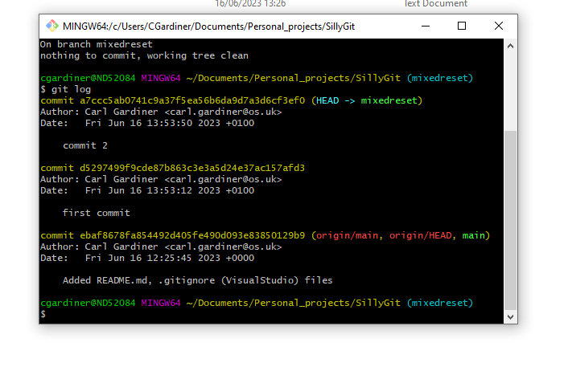
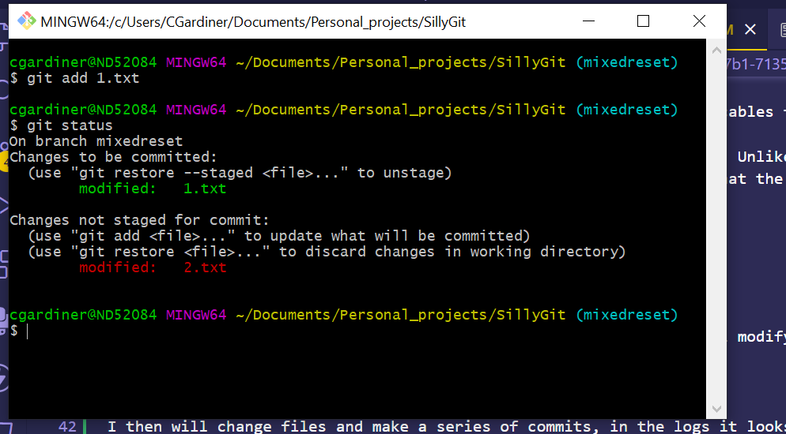
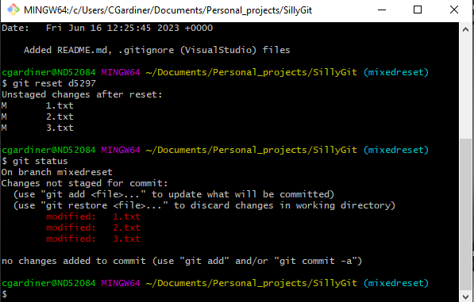

Git reset is a command for undoing changes that have occurred. It has three different arguments:

--soft
--mixed
--hard

Calling git reset on its own has the same affect as calling git reset --mixed HEAD.

I will talk about the standard git reset here as there other evidencables for the hard and soft versions of the command.

Git reset is similar to git checkout in that the HEAD pointer moves. Unlike git checkout, however, which only moves the HEAD pointer, git reset will move the current branches ref pointer as well, meaning that the HEAD will instead not be on the latest commit (in terms of when you did the commit). This is known as a detached HEAD in git.

## Starting off 

Here three files have been created. These text files are what I will modify to show how things change.

## Making a series of commits

I then will change files and make a series of commits, in the logs it looks like this:

## Change the text files

I will then change two text files, adding one and not adding the other, and performing a git status. It looks like this:

## Git reset to first commit

I will then perform a git reset, making the status look like this:

Here the HEAD and ref pointers were moved back to the first commit so that the changed were no longer in the index or the commit history, they were however still in the working directory so there were no changes to the text files in the working directory.

## What if you commit files?

If you have committed files or changes after the initial commit, a git reset will move the git history and staging directory back to the state it was in at that particular commit, meaning that even though your working tree will be unchanged, files created after and files modified after will not be part of the index or the git history once this is done.
