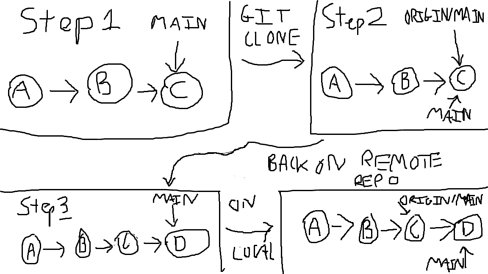
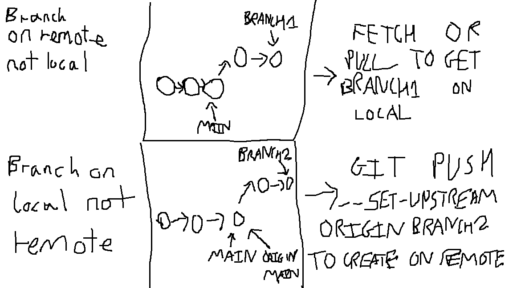

## How remote and local repos differ

Step 1 - Shows what the main branch looks like in the remote repo, with multiple commits.

Step 2 - Shows what the branches look like in the local repo. The origin/main is being tracked as a remote branch.

Step 3 - Shows that some other developer pushed up changes, changing the main branch in the remote repo, giving it another commit.

Step 4 - Shows that in the local repo, another commit has been made, but as the local repo hasn't fetched any updates, then the origin/main pointer stays where it is.

## How branches differ between local and remote repos

For the top section of the image, the branch1 is pushed up by another dev to the remote repo. As it doesn't exist on the local repo, a fetch or pull is required to download its objects and metadata into the git repository.

For the bottom section of the image, the branch2 is created on the local repository but doesn't exist on the remote repository. In order to push it up and start tracking the remote branch, the command 'git push --set-upstream origin branch2' must be used.{\rtf1}