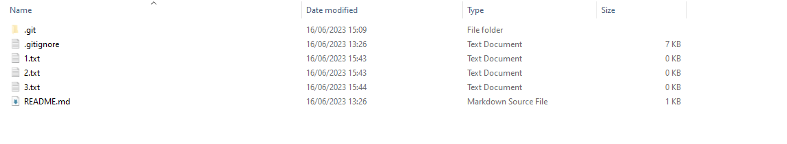
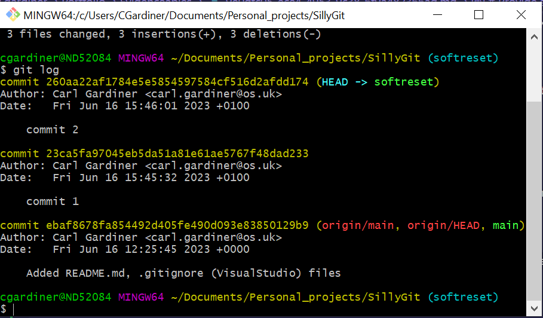
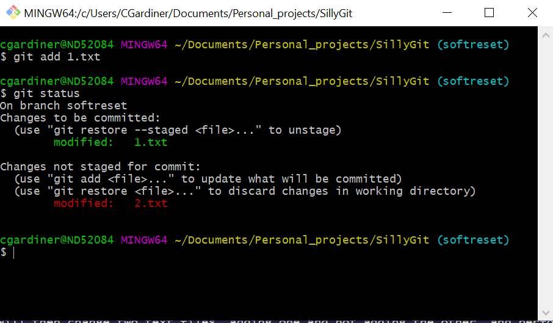
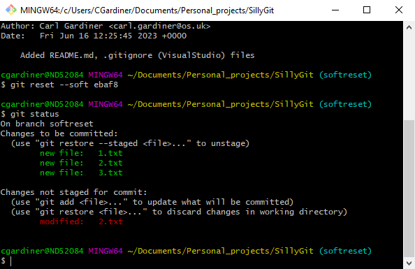

Git reset is a command for undoing changes that have occurred. It has three different arguments:

--soft
--mixed
--hard

Calling git reset on its own has the same affect as calling git reset --mixed HEAD.

I will talk about the command 'git reset --soft'.

A soft reset only resets the commit history to the intended commit, but not he staging directory or the working directory.

## Starting off

Here three text files have been created. These text files are what I will modify to show how things change.

## Making a series of commits

I then will change files and make a series of commits, in the logs it looks like this:

## Change the text files

I will then change two text files, adding one and not adding the other, and performing a git status. It looks like this:

## Git reset to first commit

I will then perform a git reset soft, making the status look like this:

This may look weird, but git soft reset works by only resetting the commit history and not the index or the working tree. As git status only shows changes across the three trees, it shows that the txt files are not yet committed but have been staged in the index and the one file (2.txt) that wasn't modified in the working tree has remained that way and is unstaged.