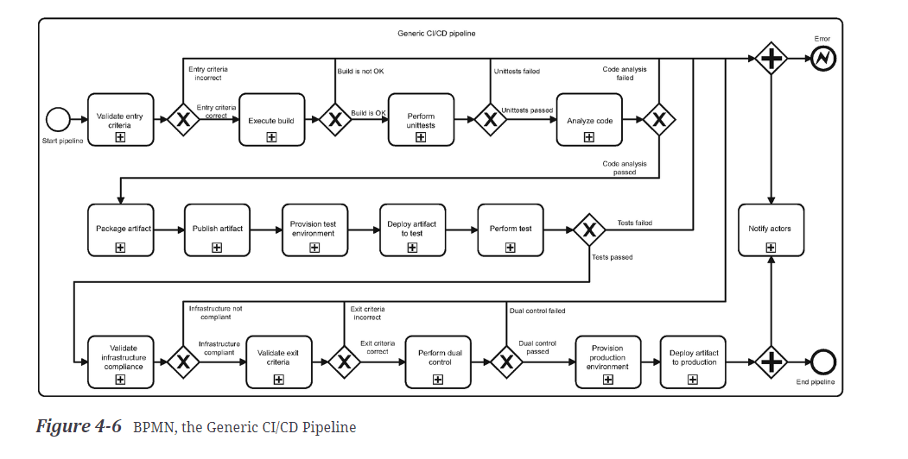

Above is a generic version of a pipeline diagram that covers a lot of the CI/CD steps. Here is an outline of the steps below.

# Validate entry criteria

Things that the pipeline needs to function, such as external http endpoints, can be tested against to see if they work before the pipeline runs and unit tests fail. In general, it is better to get the shorter pipeline stages finished before the longer ones such as unit tests so that time is not wasted on failed pipeline runs.

# Execute Build

Artifacts are built from code. In other words dependencies are downloaded and code is compiled.

# Perform Unit Tests

Unit tests are performed on the code. You can choose to skip certain unit tests however more coverage is usually better.

# Analyze Code

You can check for multiple things, such as: code quality, security vulnerabilities, credential scans, validation of Infrastructure as Code (like with bicep templates), validate pipeline code (external)

# Package Artifacts

Packages code such that it can be deployed to production.

# Publish Artifacts

Stores the artifact in an immutable binary repository. This way the same code can be downloaded across multiple different environments, ensuring that the code is not different on different builds.

# Provision Test Environment

Creation of the test environment in the cloud. Setting up and tearing down as necessary. Might be more beneficial to leave up larger test environments if they are being frequently used for testing or contain large databases that would take a long time to put up into the cloud.

# Deploy Artifacts to Test Environments

Deploying your code to the cloud infrastructure. This step will allow you to test whether you are able to actually put it on the cloud.

# Perform Test

Tests need to be completely individualised and should not interact with eachother. This is the step where you can check that the tests actually work whilst the test infrastructure and code is deployed.

# Validate Infrastructure Compliance

Tests the security vulnerabilities of the environment. Also involved scanning of IaC and pipeline code.

# Validate Exit Criteria

The last step before starting the production pipeline with the artifact. Things such as final checks on artifacts can be done here.

# Dual Control

Dual control means that someone has to approve the move into the production pipeline.

# Provision Production Environment

Create the production environment. The same Infrastructure as Code should be used for it as the test environments except with different values.

# Deploy Artifact to Production

Artifacts are downloaded again and pushed to the newly created production environment.

# Notify Actors

Notifies people about whether a pipeline succeeds or fails. This should always happen.

