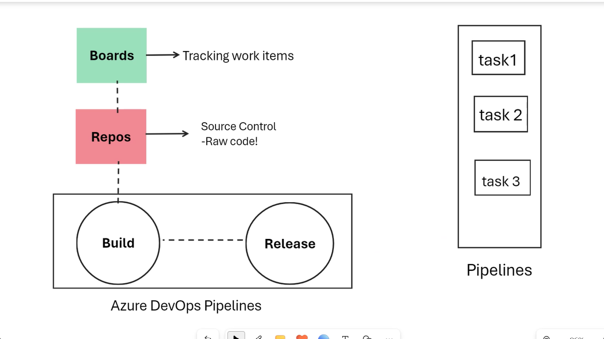

# AZ-400 Day 2

# Forking

Forking is where you create a new version of the repo where pushes from any branches do NOT go back to the original repo necessarily.

# Git Hooks

- Piece of code
- Activates when git event occurs
- Governance mechanism to implement best coding practices
- Ensure that human errors are significantly reduced

# Monorepos vs multiple repos

- Monorepo: Where all the source code is kept in a single repo
- Multiple repos - Refer to organising your projects each into their separate repository

Projects in Azure DevOps can store multiple repos

# Branch workflow

- Feature branching - All feature development should take place in a dedicated branch instead of the main branch
- Forking workflow - each developer uses a server side repository

# Workflow

Create a branch -> Add commits -> Open pull request -> Discuss and review code -> Deploy -> Merge

# Git LFS

Git Large File Storage can be used for larger repos

# Git purging 

If you need to delete files from repository (such as large files or sensitive data)

# How to deal with technical debt

Use tools such as sonar lint etc which can detect code quality problems.

Code should be:
- Clear and readable
- Documented
- Efficient
- Maintainable 
- Extensible 
- Secure

# Measure and manage technical debt

- Failed builds percentage
- Failed deployments percentage
- Ticket volume
- Bug bounce percentage
- Unplanned work percentage


# Reasons for technical debt

- Lack of coding styles and standards
- Lack of or poor design of unit tests
- Ignoring design principles
- Monolithic classes and code libraries
- Poorly architectured

# How to reduce technical debt

- Automated testing

# DevOps Pipelines

Allows you to turn the raw code from the Repos section and actually use it properly.

Build and Release

Pipelines consist of various tasks


Pipelines can be done through yaml config or classic editor(in organisation settings you can enable classic build and release pipelines).

# Workflow for pipelines

Source of code -> Add tasks in the pipeline -> Save and run

# Agents in the pipelines

Compute that runs the job in the pipeline (containerised in the backend)

Can be self-hosted or Microsoft hosted
Self-hosted on vms on-prem

Use agent pools to decide which type of agent you want. Can be set up in the agent pools section of the project settings.

# Trigger pipelines based on certain branches getting updated and certain files in those branches

```YAML
trigger:
  branches:
    include:
    - main
  paths:
    include:
    - src/web/*
```

Will trigger the pipeline if the main branch has any code changes in the src/web folder

# Publishing artifacts

You can publish artifacts for reuse using the PublishBuildArtifacts@1 task

# SonarCloud Azure DevOps extension

1) Download SonaCloud from Visual Studio Marketplace to your organisation
2) Go to sonarcloud.io
3) Log in to your account
4) Click 'Import an organisation from Azure' and use your personal access token from DevOps
5) Create an organisation key and create the organisation
6) Set up the repository you want
7) Follow the steps to set up SonarCloud for the pipelines
8) Add a SonarCloud service connection and give permissions to all pipelines

After dealing with all the steps and adding the correct steps for SonarCloud to the pipeline, when it runs it should analyse the pipeline and in the extensions tab you can view the Detailed SonarCloud report. The SonarCloud report can be used to find bugs, code smells etc in your code.

You can set it up in Azure DevOps so that if the SonarCloud check fails then the pull request will not be merged.


# Branch protection policies in Azure DevOps

- Use 'Require a minimum number of reviewers' to ensure that a PR must be created for the main branch of your code if you want to protect it
- Use 'Check for linked work items' if you want to ensure the reason for the PR is available
- Use 'Check for comment resolution' if you want to protect against other things
- Use 'Build Validation' if you want to ensure that the pull request builds correctly before it can be merged.

# Security concerns


