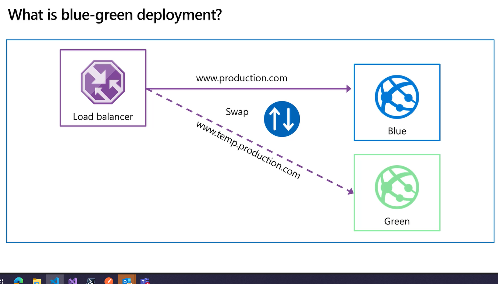
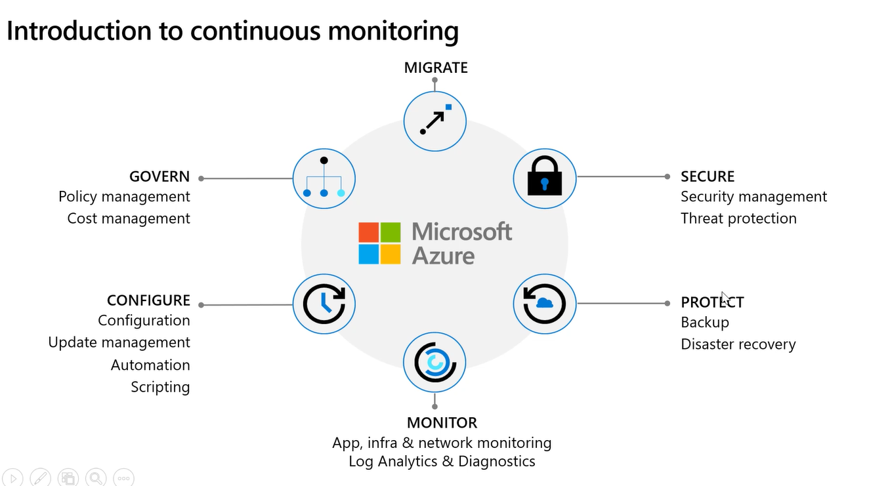

# Pre deployment and Post Deployment conditions 

Security and compliance checks

You can set up cron triggers

# Gates

You can add gates to your pipelines to ensure certain things are present before you deploy with a predeployment check.

Gates can be created that ensure manual approval before launching the next step.

There are four types of gates which are included by default in every account:

- Invoke Azure functions

- Query Azure Monitor Alerts

- Invoke REST API

- Query work items

# Task Groups

With environments you can create task groups to group tasks you plan on doing again and again.

# Modern Deployment Patterns

## Blue-Green Deployment

Two instances of the application, one already in production is blue, newer version is green. Once green is ready, you swap from blue to green with zero downtime.

Uses a load balancer to ensure that the swap happens quickly(?). Allows easy rollback to the blue environment if things go wrong.

Found in deployment slots in the sidebar of Azure on the resource such as webapp.

## Canary Releases

You can set the amount of traffic on different environments by way of traffic manager to ensure a certain percentage of users are sent to different environments. End users are aware of this.

## Progressive exposure deployment aka ring based

First target canary users, then deploy to early adopters, then the rest of the users.

## A/B Testing

A/B testing is an experiment where two or more variants are shown to users at random, and statistical analysis is used to determine which variation performs better for a given conversion goal. Data driven approach.

## Dark Launching

Like canary releases, but the aim is to assess response of users to new features. Users are not aware they are being used to test a new feature. 

## Feature Toggles

## Application Insights 

You can create Application Insights for your resources in Azure. You then need to turn on the Application Insights in that particular resource, however, by clicking on the Application Insights blade in Azure Portal (can probably be done automatically) and linking the applications insight workspace to the particular resource. You can create alert rules in the applications insights workspace.

# Continous Monitoring

## Log Analytics Workspaces

## KQL 

Kusto Query Language - language used to analyse Log Analytics

# Organisational Knowledge Capture

Use of Azure DevOps wikis to keep hold of information related to the systems.

# Dependency Management

Used because you might want to develop each component separately

