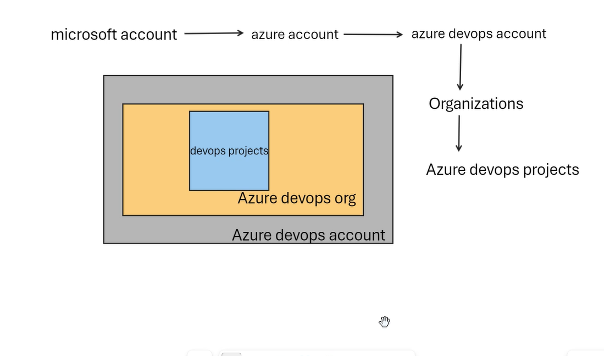
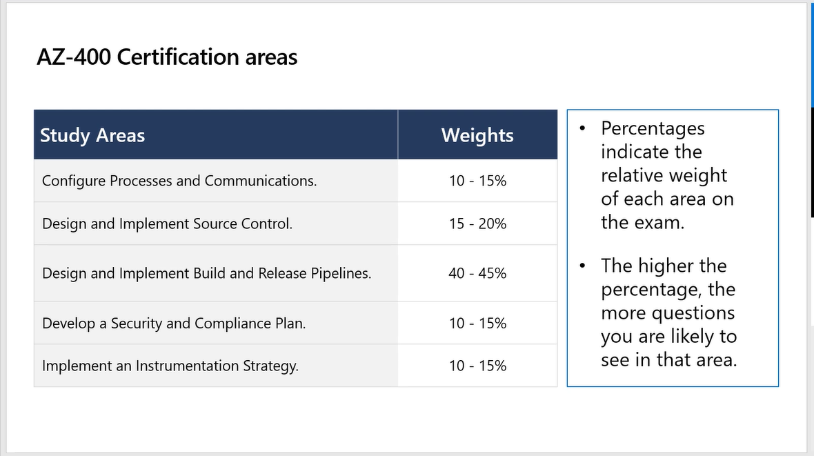
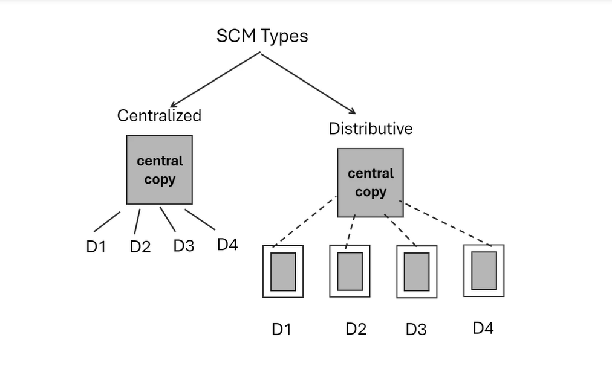

# AZ-400 training

## DevOps Projects 

# Module 1: Get started on a DevOps transformation journey

"DevOps is the union of people, process, and products to enable continuous delivery of value to end users."

## Continuous Integration
Ongoing merge of code

## Continuous Delivery
Ongoing delivery of product

The biggest problem we face in DevOps is transformation of the team.

## Greenfield Project

- Ideal for new beginnings
- Software projects devloped in a totally new environment

## Brownfield Project

- Managing older projects
- Brownfield software projects develop in the immediate presence of existing software applications/ systems

## Identify groups to minimise initial resistance
Canaries voluntarily test bleeding edge features
Early adopters voluntarily prview releases
Users consume the products after canaries and early adopters

## Ideal Target Improvements
- Can be used to gain early wins
- Are small enough to be achievable in a reasonable time-frame
- Have benefits that are significant enough to be obvious to the organisation

## Projects must have a clearly defined set of measurements of improvement
- Should be challenging yet achievable
- Timelines should be a constant series of short-term goals - each clear and measurable
- Can be KPIs (Key Performance Indicators) like more continuous integrations/ deployments, less pipeline failures, more secure pipelines, efficiency etc

# Boards in Azure DevOps
Each team has their own board in Azure DevOps

Queries can find particular work items
Sprints and backlogs can be used to hold work items in particular parts of the lifecycle

# Services in Azure DevOps

- Boards: Track the overall progress of the work items
- Repos: For source control management
- Pipelines: For build and release, CI/CD
- Test plans: For testing
- Artifacts: For dependency management, can create the artifacts, and upgrade and modify them as well

# Source control

Source control is about:
- Managing the code
- Single source of truth
- Maintains the history of changes
- Standard process for code management

# How to create policies for pull requests in Azure DevOps

- Go into branch policies in Project settings and change it there.
- Alternatively, if you want to protect a single branch (like main), you can set the policies in the branches section of the repos on the branch policies in the elipses.
