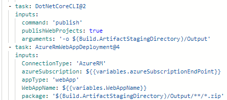
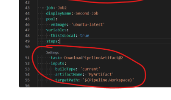

An artifact is a kind of file that your build produces, such as the compiled DLLs from the code in your pipeline. 

## Build Artifact / Pipeline Artifact

Build artifacts are artifacts that can be published and then reused between jobs in a pipeline. Publishing artifacts is done by using the publish artifact task in pipelines and looks like this:

Here the code is being published as an artifact in the pipeline and placed into the Output folder of the Build.ArtifactStagingDirectory (an inbuilt variable in pipelines). Then in the next step the code package that has been published as a build artifact is being published to the WebApp in Azure by getting it from the zipped file. Builds artifacts can be downloaded in jobs other than the one they are published in with the download task in another job like so:

## Moving Artifacts between Pipelines

Artifacts can be reused between pipelines if they are both run from the same branch (if the repo contains multiple pipelines). latestFromBranch can be used for the runVersion parameter. The parameter runBranch can use the $(Build.SourceBranch) to reuse the artifact. If the pipeline that produced the pipeline artifact only partially succeeded, you will need to use the allowPartiallySucceededBuilds: true parameter otherwise the branch won't have the artifacts available as it will not recognise that a build exists. The buildPipelineId also has something to do with this but I am unsure on the specifics.

## Universal Artifact

Universal Artifacts are pieces of code that are uploaded and can be made available for your organisation. This is what is in the Azure Artifacts section on DevOps and allows you to download the code as a package elsewhere through package managers such as NuGet.
