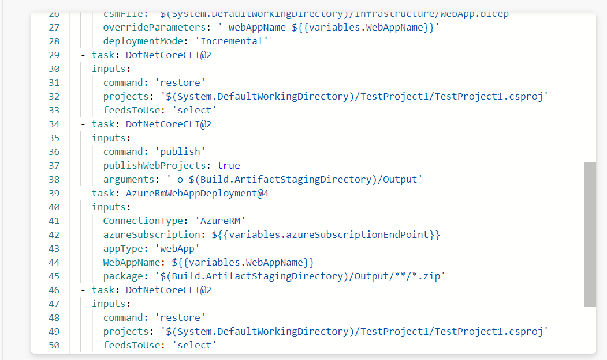

Built in variables are variables in YAML pipelines that are already set and read-only (except for Build.Clean and System.Debug).

## Examples

Examples include things like System.DefaultWorkingDirectory, which is the local path where your source code files are downloaded, or Build.ArtifactStagingDirectory, where artifacts are copied to before being pushed to their destination.

## Usage in real code

Here, the System.DefaultWorkingDirectory is being used to reference the csproj being restored, the Build.ArtifactStagingDirectory is being used to reference where to publish the artifacts and where to retrieve the code artifacts from to be uploaded to the WebApp.