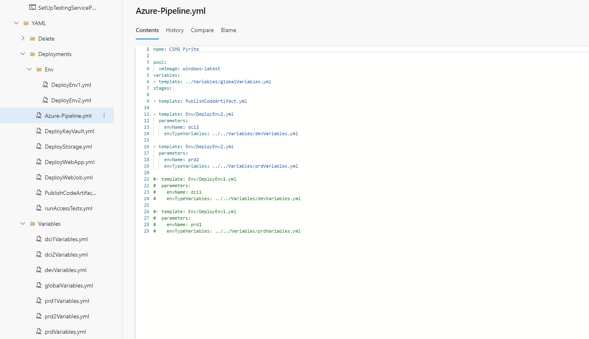
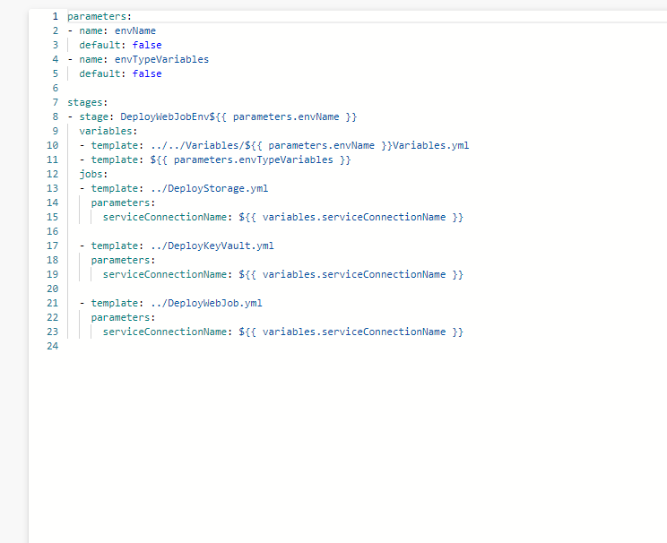

## Templates in pipelines
Templates in pipelines can be used to put reusable code into your YAML pipelines. You can specify parameters for templates and as well as logic and this can then be referenced in other YAML files. In this way they are similar to functions in traditional programming languages.

## Example 1 of a template

Here is a YAML file where global variables are plugged in for the whole pipeline via the template in the variables section. This allows these variables to be reused throughout the pipeline. After that, templates are used to run specific stages of the pipeline and arguments are given to parameters to allow be used in those template files.

## Example 2 of a template

Here is one of the templates referenced from the previous image. As you can see, the arguments passed in above are take the place of the parameters which are set to false by default. Further variables templates are plugged in and the jobs are carried out by further use of templates which each have arguments passed into their parameters.