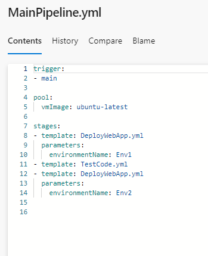
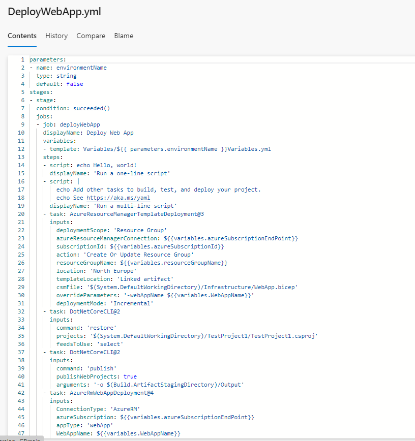

Here the tests template going over the unit tests for the code runs after the deployment to the dev environment, preventing the prod deployment if the unit tests fail.

Here is the condition of succeeded() which specifies whether or not the WebApp deployment will happen on the second deploy. This prevents the stage from running if the tests do not pass.
