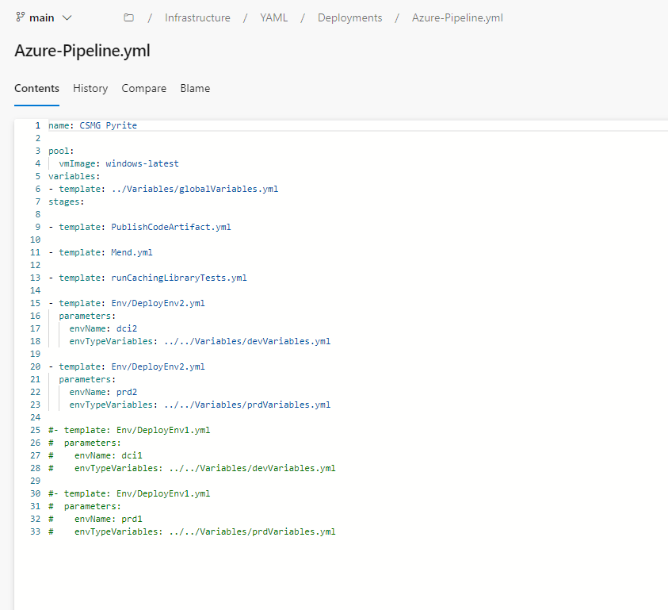
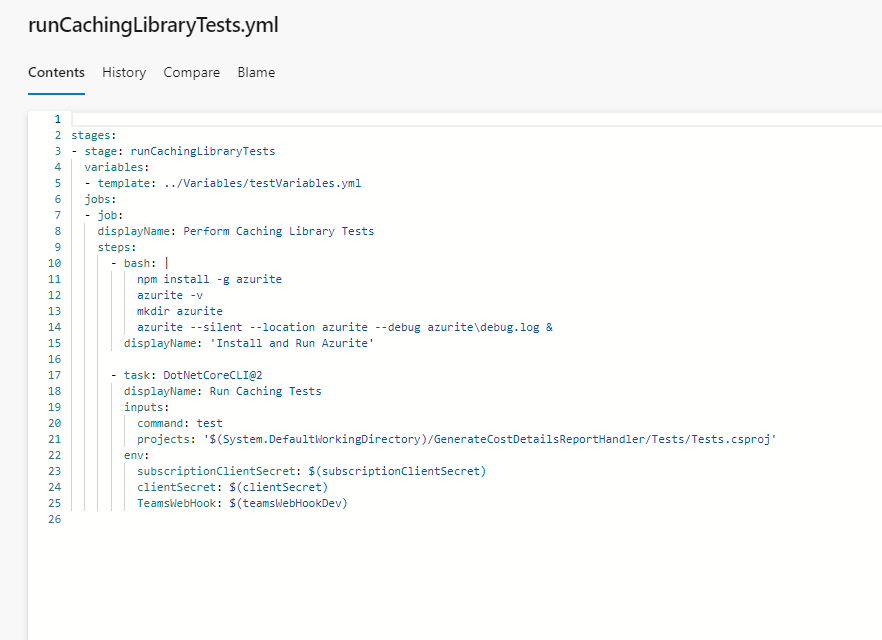

Here is the pipeline we created for the Cost Management Caching that called on the tests in their own specific stage for 'runCachingLibraryTests.yml':

From there, here is the actual stage that runs:

In this, Azurite is installed due to the fact many of the tests use it to handle Table Storage processes. The testing project is then linked in the next step and environment variables needed for the tests to run properly are plugged in aswell.