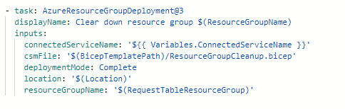

In order to delete resource groups, you can run a resource group deployment step using an empty bicep file. This will remove all the contents in the resource group. You can then run ACES with the resource group removed and it should be deleted permanently. You may also need to purge keyvaults.

Here is a step showing how to delete a resource group, with the bicep file being completely empty:

