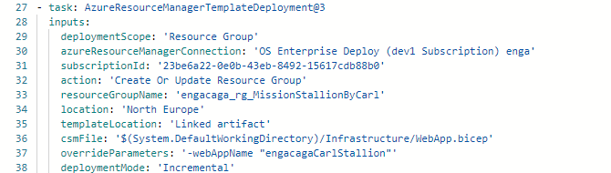
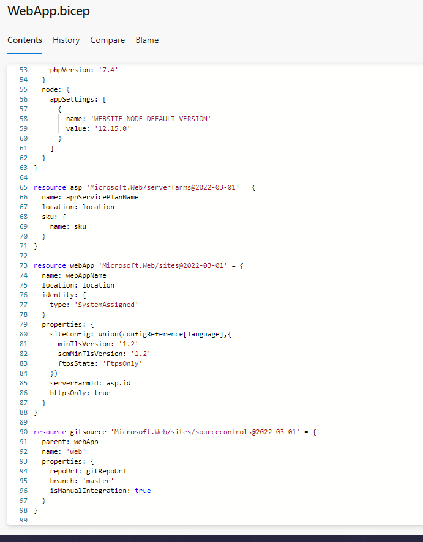
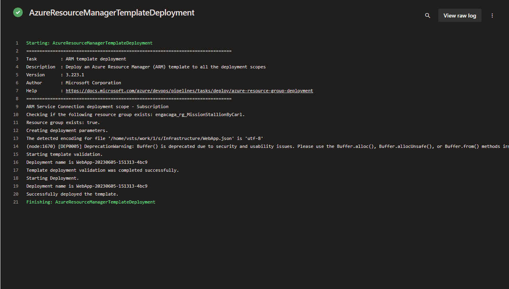
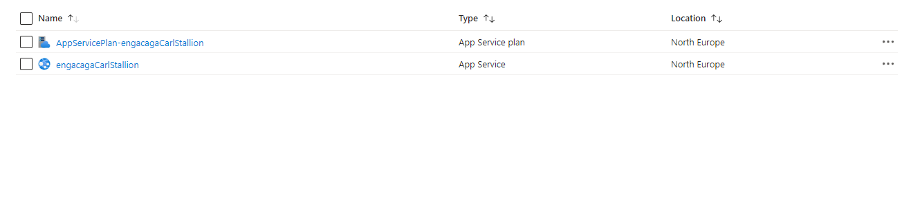

ARM templates are used to deploy resources to Azure. They are declarative and idempotent, meaning you can deploy the same file many times (in pipeline retries for example) and get the same resources in the same state. ARM templates can be in JSON or Microsoft's own bicep syntax, although bicep is easier to read and therefore preferred.

## Task in YAML pipeline to call on ARM template

## Bicep File Used

## Pipeline creating WebApp

## WebApp in Azure

