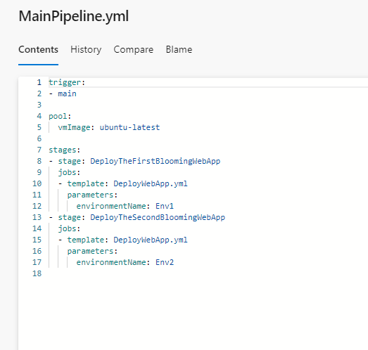
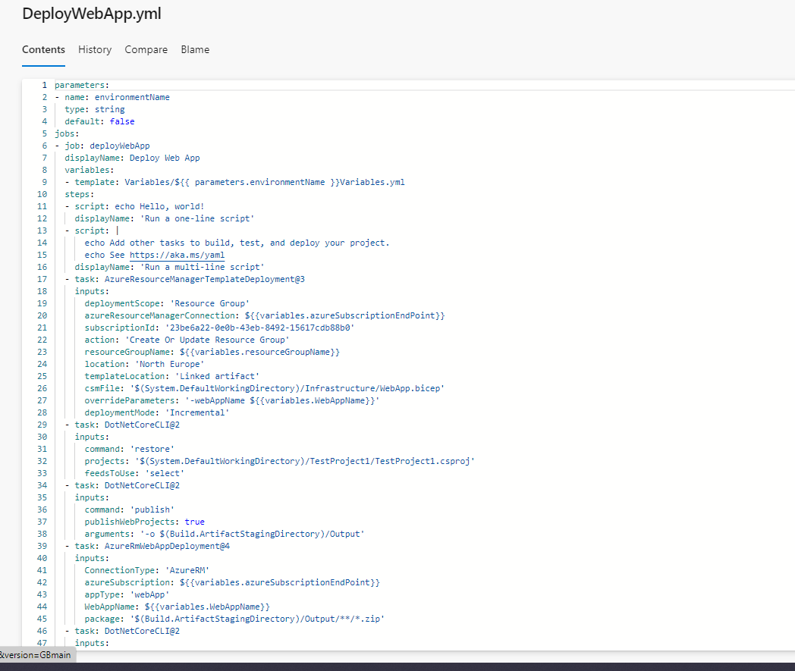
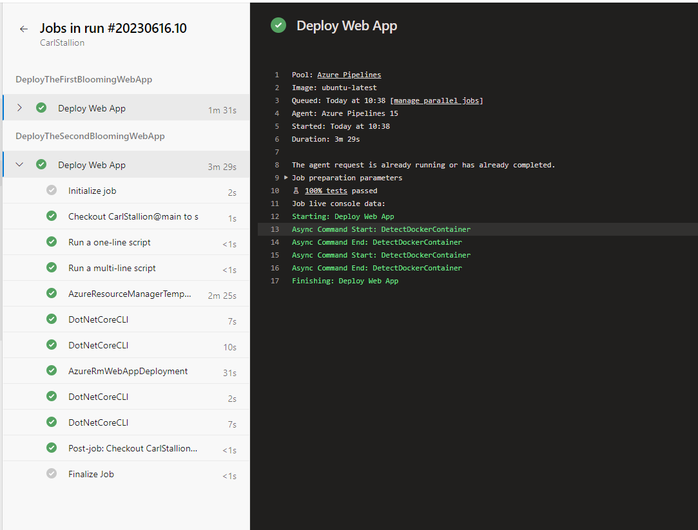

The purpose of this mission is to deploy a WebAPI to two environments, using a single environment template and two parameter files, through a YAML pipeline in Azure DevOps.

# Steps

## Create a new resource group

Using ACES, create a new resource group inside your environment.

## Create a variables folder

Create two variables files in this folder. Then define variables in the specific files.

## Define main pipeline file

Define a main pipeline file (when you run the pipeline you'll have to swap to this one) and move the trigger and pool properties over to this. Then set stages with templates and parameters put in.

#
## Change variables

Change and place the variables and parameters where the template is called, like so: 

## Proof that Mission Golden worked

## Lesson learned 

## Where pipeline is kicked off from
In this task I swapped where the pipeline was kicked off from without actually swapping on the pipeline run. This caused the variables not to work.

## Naming of stages, jobs and steps
Must be alphanumeric and not have spaces. You can use a displayName property otherwise.

## Check indenting of stages, names and jobs
Check the indentation and if the list items are actually part of the list. Then check the amount of times used. If you use a template under a stages-stage bit you can't use stages again but can you use stage.