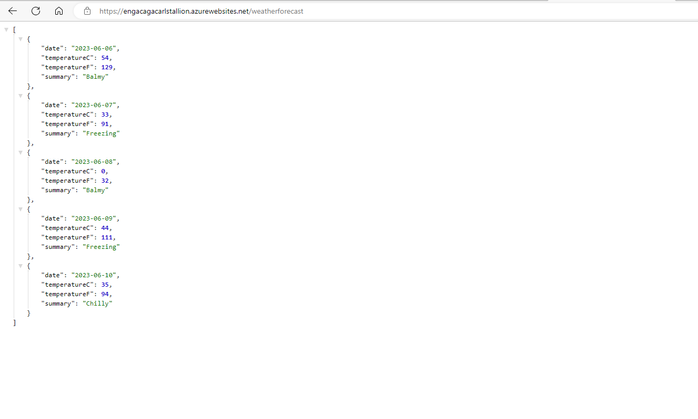

## Setting up Resource Groups in ACES

In order to create a resource group in ACES, go to the enterprise-aces deployment profiles, branch off, add your resource group to the deployment profile, create a pr and after validation merge back into main. Then check in azure portal to make sure that the resource group has been deployed (this may take a while).

## Setting up the WebAPI
Clone a repo down to your machine, then on the command line use 
'''
dotnet new webapi
'''
To create a generic webAPI. Then commit and push to a repo in DevOps.

## Setting up a starter YAML Pipeline

- Go to Pipelines in Azure DevOps
- Select New Pipeline
- Select Azure Repos Git on the where is your code? page
- Select the repo which you want to use
- Select Starter Pipeline
- Here you can change the value of the azure-pipelines.yml filename.
- Click save and run

## Adding a Task to deploy the WebApp
- Create a folder with a generic bicep template you can find elsewhere called Infrastructure
- Click the three dots in the Pipelines tab and click on edit
- Add an ARM or bicep template
- Fill in the values of resource groups and such.
- Add the template using the $(System.DefaultWorkingDirectory), linking to the place you saved the bicep template.
- Add override parameters of webAppName with the webAppName being the system code plus the environment code plus the name of the webApp.
- Commit and run the pipeline.

## Add a task to package the WebAPI
- In the pipeline, get a Task for .NET Core to publish the WebAPI.
- Set the command to publish
- Set the Arguments to -o $(Build.ArtifactStagingDirectory)/Output - this is the output folder, and we set it only so that we have a predictable place to find our packaged code

## Add a task to deploy the WebAPI to the WebApp
- Add the Azure App Service Deploy Task to the yaml pipeline
- App Service type must be Web App on Windows
- App Service name must match the one supplied to the ARM template deployment task. This can be found on Azure after the webapp stuff has been added. This might need some retries or pulling out variables.
- Change Package or folder to match the output path supplied to the package command. Append the wildcard match of /**/*.zip if not done already. MAKE SURE THAT YOU HAVE THE /Output BEFORE the /** to  make it point to it. YOU MUST ALSO Point to the build.artifactstagingdirectory

## Proof of deployment
