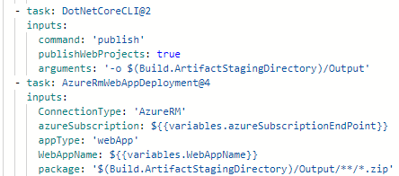

An artifact is a kind of file that your build produces, such as the compiled DLLs from the code in your pipeline. 

## Build Artifact / Pipeline Artifact

Build artifacts are artifacts that can be published and then reused between jobs in a pipeline. Publishing artifacts is done by using the publish artifact task in pipelines and looks like this:

