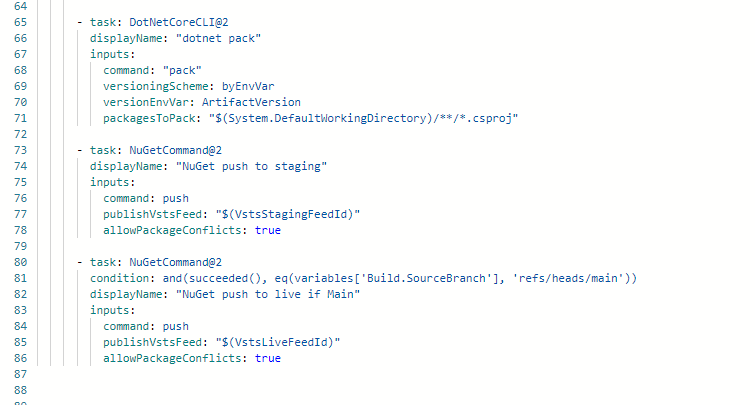

## Universal Artifact

Universal Artifacts are pieces of code that are uploaded and can be made available for your organisation. This is what is in the Azure Artifacts section on DevOps and allows you to download the code as a package elsewhere through package managers such as NuGet.

You can publish universal artifacts throug the Azure CLI with the command:

```PowerShell
az artifacts universal publish --organization https://dev.azure.com/<YOUR_ORGANIZATION> --feed <FEED_NAME> --name <PACKAGE_NAME> --version <PACKAGE_VERSION> --path <PACKAGE_DIRECTORY> --description <PACKAGE_DESCRIPTION>
```

Here is how the universal artifact was created in the old Cost Management Library back in the day for Nuget packages:

