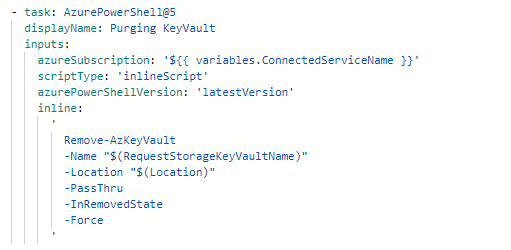

Purging a keyvault is necessary before deleting the resource group. You can do this like so:

Without purging the keyvault, it will be set to soft delete, meaning ACES won't necessarily delete the resources you want.