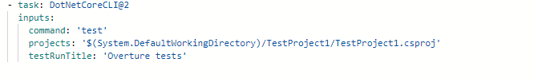
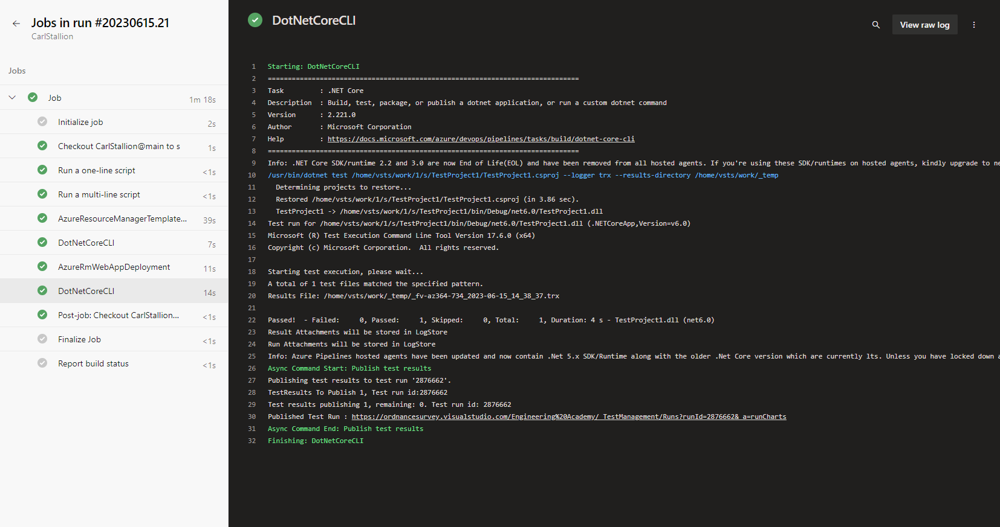

The purpose of Mission Overture was to run integration tests in an Azure Pipeline to ensure the WebAPI deployed in Mission Stallion worked correctly.

## Set up 
Moved the Stallion Project into its own folder.
Created a project in Visual Studio for the MSUnitProject.
Made sure the test project works in Visual Studio.

## Adding DotNetCoreCLI@2 test step

Here is the code for adding the testing step for Mission Overture:

## Proof of the tests running in the pipeline

## Notes from doing this

Using the command line to make the MSTest project originally caused me all sorts of problems as I had not put my Stallion project into its own folder. It took some doing to undo the tangled mess of projects that came from this. In the future I will put different projects into different folders, probably doing this in Visual Studio.

The test step will automatically restore and publish for the current job so you don't need all the steps that are available there.