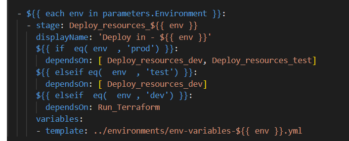
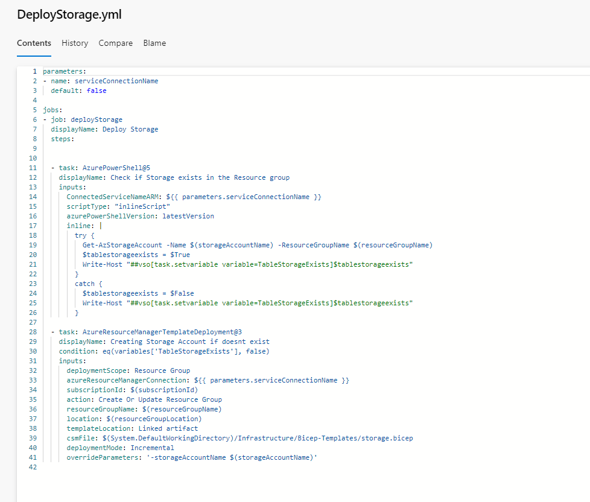

# Demonstrate use of conditional logic within a pipeline

## dependsOn

Conditional logic can be used in YAML Pipelines in order to create a control flow for stages, jobs and steps. The most basic of these is the dependsOn property:

```yaml
jobs:
- job: HelloWorld
  steps:
  - script: echo Hello World!

- job: GoodByeWorld
  dependsOn: Foo
  steps:
  - script: echo Goodbye World!
```

Here the job GoodByeWorld depends on the job HelloWorld running through to completion. It will not be run unless that happens. This dependsOn property can also be used for stages and steps.

## always and failed

You can also change up how the stage, job or step runs by using always() or failed() in the condition, like so:

```yaml
jobs:
- job: HelloWorld
  steps:
  - script: echo Hello World!
	condition: always()

- job: GoodByeWorld
  dependsOn: Foo
  steps:
  - script: echo Goodbye World!
	condition: failed()
```

Here the HelloWorld job will always run, which can be useful in certain scenarios if you wanted a cleanup or monitoring job for example. The GoodByeWorld job will only run if HelloWorld fails, as it both dependsOn it and has the condition set to failed().

## Other types of conditions

You can also put other types of more normal conditions in place in your pipelines, like so:

```yaml
variables:
	isThisTrue: true

stages:
- stage: runIfTrue
  condition: eq(variables.isThisTrue, true)
  # jobs to run
```

This checks if the isThisTrue variable is true before running the stage.

## If, else, else if



Here is an example I found online of someone's code that had created if else statements in their yaml pipeline. The environment variable of env is plugged in at the top and different dependsOn conditions are called depending on whether the environment is prod, dev or test. This functions like if-else statements in standard programming languages.

## Example in the real world

Here is a an example used in the Cost Management Pyrite project:



Here a PowerShell script is run to check whether table storage exists in the storage account and it populates a variable with either true or false. The second task is only run to create table storage if the first task makes the variable TableStorageExists false.


