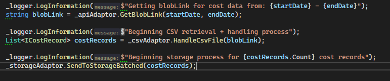

## Reason for log messages
Log messages can allow you to track down bugs by allowing you to narrow down where a bug occurred and what steps a program had gone through before reaching there. This is especially helpful in pipelines where you do not have the benefit of a debugger you might otherwise have in your IDE.

## Console.WriteLine
For basic console applications in C# the Console.WriteLine method can be useful for logging messages.

## More helpful methods of logging
When putting code into pipelines, it can be more beneficial to use LoggerFactory, as seen here:

From here, with dependency injection, you can add logs all throughout your code which will run when you hit them. For example:

