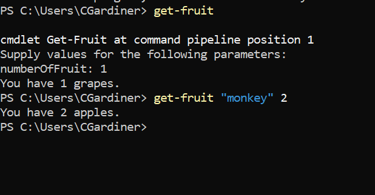

## Function that takes mandatory and optional parameters

```PowerShell
function Get-Fruit {
	param(
		[Parameter(Mandatory=$false)][string] $extraFruit = "banana",
		[Parameter(Mandatory=$true)][int] $numberOfFruit
	)
	$fruits = "apple", "grape", $extraFruit

	$Generator = New-Object System.Random

	$Index = [int]$Generator.next(0, $fruits.Count)
	$fruit = $fruits[$index] + "s"
	Write-Host "You have $numberOfFruit $fruit."
}
```
The function above takes an optional argument that it adds to the fruits array and then picks a random fruit from the fruits array and writes "You have " and then the number supplied as a mandatory argument and the random fruit.

## How it works
The parameters are listed in the param() section and the Mandatory value is set to either $true or $false in order to specify whether or not that field is needed. In this function, when it is called you can omit the $extraFruit variable if you call the function without supplying the $numberOfFruit variable it will ask for one.

## Evidence of it running in the shell
