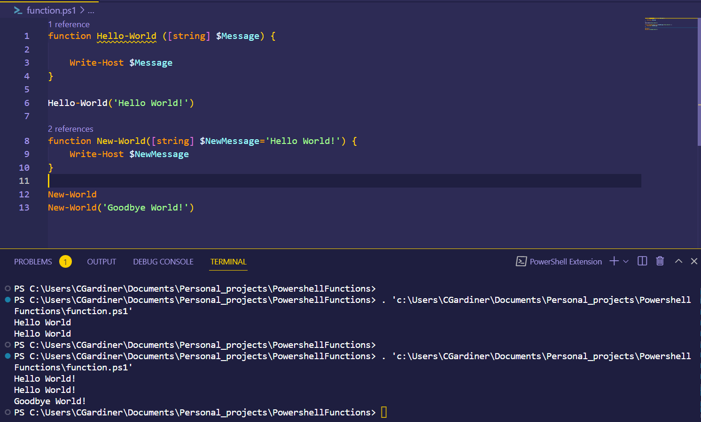

As you can see above, there are two functions which take in a parameter of type string. The first function, Hello-World takes in a string and prints that to the terminal. 

The second function, New-World, does the same thing but defaults to 'Hello World!' in the absence of any argument passed. This allows you to use the function without the () syntax on the end with the function still making sense. PowerShell actually doesn't make the function parameters necessary unless you state otherwise.

The final function call calls on the New-World function but with 'Goodbye World!' as an argument instead, overriding the default parameter.

You can move into scripts with . before a filepath and then call on function  on the next line like:

```PowerShell
. <filepath> 
function name