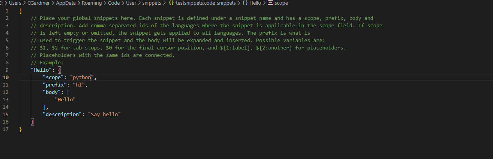

# Using basic snippets
In VS Code, click on File -> Preferences -> Configure User Snippets -> New Global Snippets File -> Name file to create it.

You can then uncomment the code and change certain values. The scope includes which languages the snippets will work for and the prefix is the actual thing you'll type in. The body is the actual part of the snippet that will be created when the prefix is selected once the prefix has been typed out.

## Using variables in snippets
You can also set up variables by using $ syntax with the number after the dollar sign. For example:

```C#
"Console.WriteLine("$1");"
```

will take you to the 1 when the snippet is created. Having a $2 will bring it to that in the second tab stop.

## Using default values

You can use default values for tab stops with:

```C#
"Console.WriteLine("{$1: 12}");"
```

will make 12 the default value in the Console.WriteLine.

## Creating custom recommendation lists

You can create custom recommendation lists that will appear when the tab stop falls on that part of the code:

```C#
"Console.WriteLine("{$1|12, 9, 5, 6|}");"
```

Would bring up options of 12, 9, 5 or 6 when tab stopped at the first tab stop.

## Example of snippet

