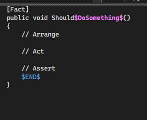
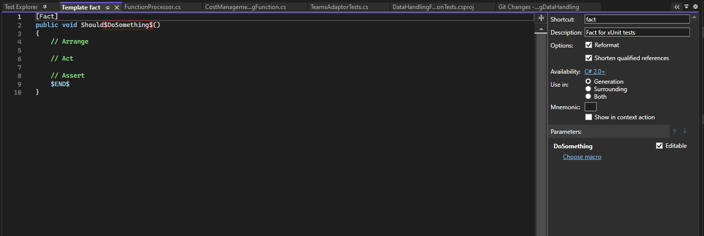

Above is a snippet set up in Visual Studio to allow you to create a fact for testing purposes.

## ReSharper snippets

If you are using ReSharper Snippets can be found in extensions - resharper - tools - templates explorer

### How to add snippets in VS ReSharper

In Templates explorer access new Template symbol

Arrange a new template using variables. The $ symbols allow you essentially count these things as variables that you can easily tab to in ReSharper.

